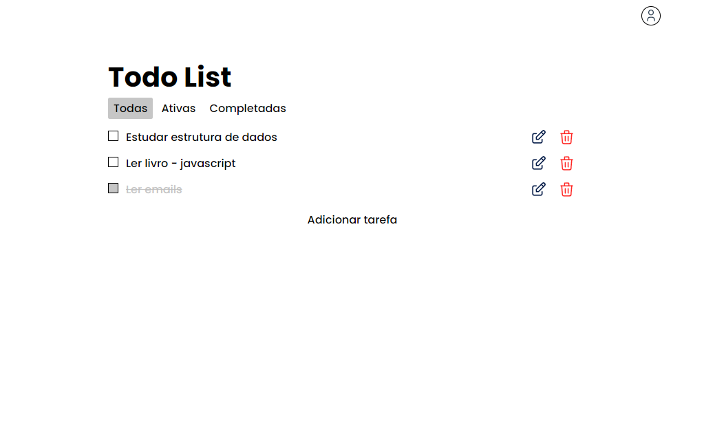

# Todo List
> Uma Todo List, onde é possível criar uma conta e organizar suas tarefas. 

## Preview
**Tela de login:**


**Tela principal:**



## Tecnologias

Esse projeto foi desenvolvido com as seguintes tecnologias:

- HTML
- CSS
- JavaScript
- NodeJS
- EJS
- Express
- MongoDB
- Webpack

## Como rodar o projeto
1. Clone o projeto
```bash
git clone https://github.com/CarlosAndre02/todo-list.git
```

2. Entre na pasta do projeto
```bash
cd todo-list
```

3. Configure as variáveis de ambiente
- Crie uma cópia do arquivo `.env.example` chamada `.env`.
- Dentro do arquivo, configure essas variáveis:
    - `CONNECTIONSTRING`: String de conexão com o MongoDB Atlas 

4. Instale todos os pacotes do projeto
```bash
npm install
```

5. Rode o projeto.
```bash
npm start
```

6. Acesse `http://localhost:3000` no seu navegador.